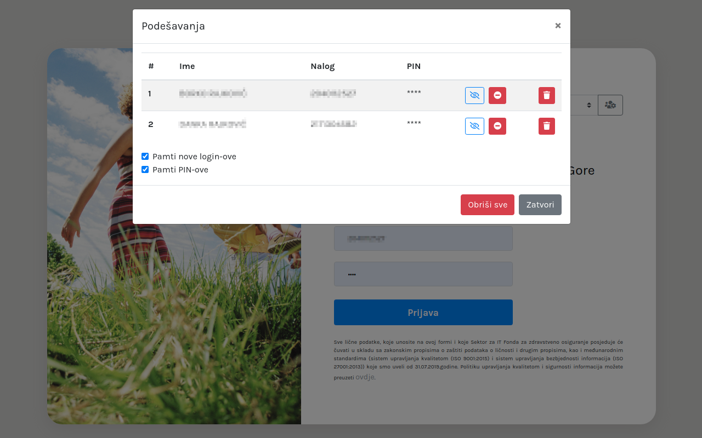

# e-zdravlje chrome-ext

Chrome extension for ezdravlje.me login for citizens

[![LinkedIn][linkedin-shield]][linkedin-url]
[![Twitter][twitter-shield]][twitter-url]

<!-- PROJECT LOGO -->
<br />
<p align="center">
  <a href="https://github.com/borko-rajkovic/e-zdravlje-chrome-ext">
    
  </a>

  <h3 align="center"><a href="https://www.ezdravlje.me/ezdravlje/authorization-server/login">e-zdravlje</a> chrome extension</h3>

  <p align="center">
    Google chrome extension that provides bookmarks for episodes
    <br />
    <a href="https://github.com/borko-rajkovic/e-zdravlje-chrome-ext/issues">Report Bug</a>
    ·
    <a href="https://github.com/borko-rajkovic/e-zdravlje-chrome-ext/issues">Request Feature</a>
  </p>
</p>

<!-- TABLE OF CONTENTS -->

## Table of Contents

- [e-zdravlje chrome-ext](#e-zdravlje-chrome-ext)
  - [Table of Contents](#table-of-contents)
  - [About The Project](#about-the-project)
  - [Instructions](#instructions)
    - [Install](#install)
    - [Running extension for the first time](#running-extension-for-the-first-time)
    - [Settings](#settings)
      - [Discover PIN](#discover-pin)
      - [Remove PIN](#remove-pin)
      - [Delete user](#delete-user)
      - [Do not remember new users](#do-not-remember-new-users)
      - [Do not remember PINs for new users](#do-not-remember-pins-for-new-users)
      - [Remove all users](#remove-all-users)
    - [Uninstall](#uninstall)
  - [Instructions for developers](#instructions-for-developers)
  - [Contributing](#contributing)
  - [Contact](#contact)

## About The Project

**e-zdravlje chrome-ext** is the Google Chrome extension that allows users to keep their login ids remembered along with their PIN codes and name.

It's useful in cases where multiple family members use the same PC for accessing **e-zdravlje** portal.

## Instructions

Here you will find instructions for how to use extension. If you are looking for instructions on how to setup extension for development, check out [Instructions for developers](#instructions-for-developers)

### Install

This extension is installed by adding it to Chrome via link:

```
https://chrome.google.com/webstore/detail/e-zdravlje-chrome-ext/lcnnbklmlpgmfnflmiedjnmihffgoogi
```

Just click `Add to Chrome` and you should be ready to go.

### Running extension for the first time

As this extension is triggered by `e-zdravlje` portal, you need to open e-zdravlje login page in new tab. Here's the link:

```
https://www.ezdravlje.me/ezdravlje/authorization-server/login
```

When page is opened, you should see something like this:


Just type in your login credentials and login. Once login is successful, extension will save your credentials in **localstorage** along with the name of the user (it's taken from e-zdravlje portal itself).

Next time when you go to login page, you will see no longer info alert (in blue) and will be able to select from the list of users.

> **Important** If you want to disable saving PIN or users at all, check further instructions

### Settings

Alongside basic functionality, here are some additional settings that can be opened if you click on button that is appended to list of users on login page. Check out this screen-shot:



#### Discover PIN

Alongside every saved user, there is possible saved PIN, which is not shown initialy. Visibility of the PIN itself can be toggled by clicking on `eye` button as can be seen in screenshot above

#### Remove PIN

Next to `eye` button there is also a button that will remove PIN so it's not saved anymore in localstorage

#### Delete user

If you want to remove a user from your list of saved users, you can use `trash can` button on far right side of the user

#### Do not remember new users

If you do not wish to remember any new users, you can uncheck the checkbox `Pamti nove login-ove`

#### Do not remember PINs for new users

If you do not wish to remember PIN for new users, you can uncheck the checkbox `Pamti PIN-ove`

#### Remove all users

To delete all users, simply click `Obrisi sve` button

### Uninstall

Go to main Chrome menu -> More tools -> Extensions, find `e-zdravlje chrome-ext` and click `Remove` button

## Instructions for developers

- Clone repository
- Open `Extensions` menu
- Enable `Developer mode`
- Click `Load unpacked`
- Select cloned repository folder

<!-- CONTRIBUTING -->

## Contributing

Contributions are what make the open source community such an amazing place to learn, inspire, and create. Any contributions you make are **greatly appreciated**.

1. Fork the Project
2. Create your Feature Branch (`git checkout -b feature/AmazingFeature`)
3. Commit your Changes (`git commit -m 'Add some AmazingFeature`)
4. Push to the Branch (`git push origin feature/AmazingFeature`)
5. Open a Pull Request

<!-- CONTACT -->

## Contact

Borko Rajkovic

[![LinkedIn][linkedin-shield]][linkedin-url]
[![Twitter][twitter-shield]][twitter-url]

rajkovicborko@gmail.com

<!-- MARKDOWN LINKS & IMAGES -->

[linkedin-shield]: https://img.shields.io/badge/-LinkedIn-black.svg?style=flat-square&logo=linkedin&colorB=555
[linkedin-url]: https://linkedin.com/in/borko-rajkovic/
[twitter-shield]: https://img.shields.io/twitter/url?label=Twitter&style=social&url=https%3A%2F%2Ftwitter.com%2Fborko_88
[twitter-url]: https://twitter.com/borko_88
